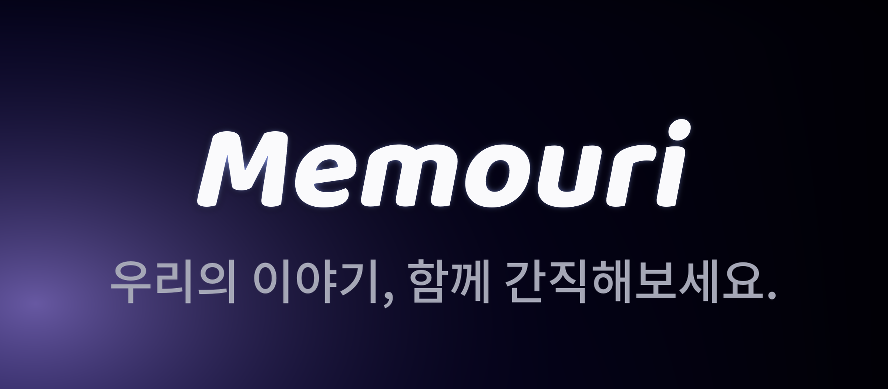
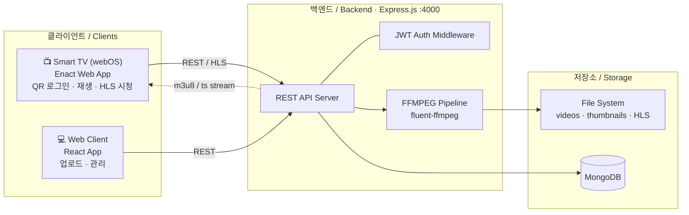
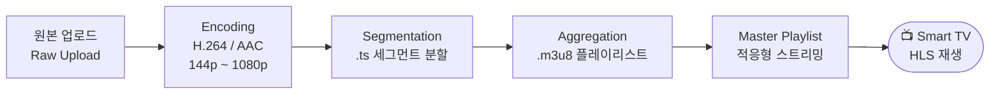
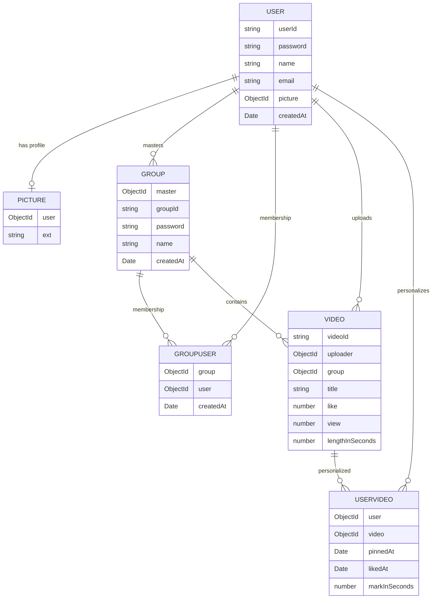
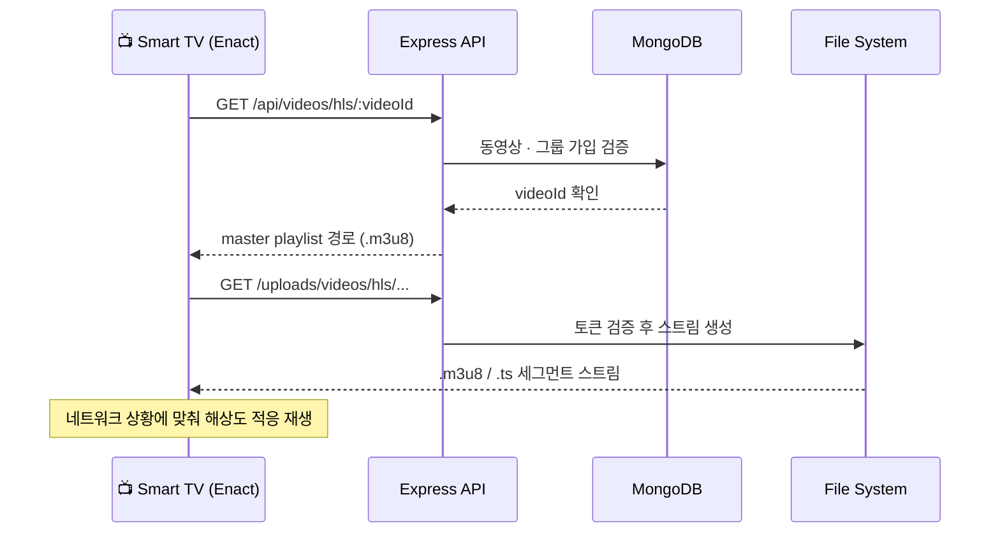

<div align="center">

# Memouri



**WebOS 기반 LG 스마트 TV 미디어 웹앱 · 그룹 기반 소셜 미디어 스트리밍 서비스**

**A media streaming web app for LG Smart TV (webOS) — a group-based social media service**

<br/>


`2023.09 ~ 2023.12` · `Team of 4 (FE 2 · BE 2)` · `LG전자 산학연계 프로젝트 / LG Electronics Industry-Academia Project`

</div>

---

## 📌 개요 / Overview

**KO** — `Memouri`는 LG전자에서 개설한 산학연계 프로젝트 과목에서 제작한 미디어 스트리밍 웹 앱입니다. LG 스마트 TV의 운영체제인 webOS 환경에서 구동되며, **'그룹'** 단위로 같은 관심사·목적을 가진 사용자들이 동영상을 게시하고 상호작용하는 소셜 미디어 서비스입니다. 기존 미디어 기반 소셜 미디어와 달리, 사용자가 직접 콘텐츠를 선택하고 개인화된 경험을 키워 나가는 데 중점을 둡니다.

**EN** — `Memouri` is a media streaming web app built for an industry-academia collaboration course hosted by LG Electronics. Running on **webOS** (the OS of LG Smart TVs), it is a social media service where users sharing common interests interact in **groups** by posting and watching videos. Unlike content-feed-driven social media, Memouri focuses on letting users curate their own content and build a personalized experience.

---

## 👤 담당 역할 / My Role

> **Back-end** — 인증 API를 제외한 백엔드 전 영역 단독 개발
> **Back-end** — Sole developer of the entire backend, excluding the authentication API

REST API 설계 및 구현, FFMPEG 기반 미디어 처리 파이프라인, HLS 적응형 스트리밍, MongoDB 스키마 설계, 파일 시스템 관리, 문서화(설계·API·테스트)를 단독으로 담당했습니다.

Responsible for REST API design & implementation, the FFMPEG media-processing pipeline, HLS adaptive streaming, MongoDB schema design, file-system management, and documentation (design, API, test plans).

---

## 🛠 기술 스택 / Tech Stack

| 구분 / Category | 사용 기술 / Technologies |
| :--- | :--- |
| **Runtime** | Node.js |
| **Framework** | Express.js |
| **Database** | MongoDB (Mongoose) |
| **Media Processing** | FFMPEG (`fluent-ffmpeg`) |
| **Streaming** | HLS (HTTP Live Streaming) |
| **Auth** | JWT (access / refresh token) |
| **Front-end** *(team)* | Enact (Smart TV), React (Web) |

---

## ✨ 주요 기능 / Key Features

- **그룹 기반 상호작용 / Group-based interaction** — 그룹 생성·가입·탈퇴, 동영상 게시, 좋아요 표시 
  Create/join/leave groups, post videos, and like content within a group.
- **QR 코드 로그인 / QR code login** — 리모콘 입력의 번거로움을 줄이는 모바일 QR 로그인 *(인증 API, 팀원 담당)*
  Mobile QR login to avoid cumbersome remote-control input *(auth API by teammate)*.
- **개인화 경험 / Personalized experience** — 사용자별 이어보기 시점, 동영상 핀(고정) 설정
  Per-user resume-playback position and pinned-video settings.
- **동적 썸네일 / Dynamic thumbnails** — 5초 단위로 추출된 썸네일을 사용자의 시청 시점에 맞춰 가변적으로 제공
  Thumbnails extracted at 5-second intervals, served dynamically per user's watch progress.
- **적응형 스트리밍 / Adaptive streaming** — HLS로 네트워크 상황 변화에도 끊김 없는 재생 지원 (최대 1080p)
  HLS-based adaptive streaming for smooth playback under varying network conditions (up to 1080p).

---

## 🏗 시스템 아키텍처 / System Architecture



---

## 🎞 미디어 스트리밍 파이프라인 / Media Streaming Pipeline

**KO** — 업로드된 원본 동영상은 FFMPEG을 통해 **[Encoding → Segmentation → Aggregation]** 파이프라인을 거쳐 해상도별 HLS 콘텐츠로 변환됩니다. 최종적으로 마스터 플레이리스트를 통해 클라이언트가 네트워크 상황에 맞는 해상도를 적응적으로 선택하여 재생합니다.

**EN** — Uploaded raw videos pass through an FFMPEG **[Encoding → Segmentation → Aggregation]** pipeline, producing per-resolution HLS content. A master playlist then lets the client adaptively select the resolution that best fits current network conditions.



---

## 🗄 데이터 모델 / Data Model

**KO** — NoSQL(MongoDB)을 사용해 사용자–그룹, 사용자–동영상 간 **다대다 관계**를 `GroupUser`, `UserVideo` 등의 별도 스키마로 표현했습니다. 동영상·썸네일·인코딩 파일의 경로는 `videoId`만으로 일관되게 유도되도록 설계하여, 경로를 DB에 저장하지 않고 공간 효율과 일관성을 확보했습니다.

**EN** — Using MongoDB, **many-to-many** relations (user–group, user–video) are modeled via dedicated `GroupUser` and `UserVideo` schemas. All file paths for videos, thumbnails, and encoded media are derived solely from `videoId`, so paths are never persisted in the DB — improving storage efficiency and consistency.



---

## 🔄 스트리밍 시퀀스 / Streaming Sequence



---

## 🔌 API 개요 / API Overview

> 모든 인증이 필요한 엔드포인트는 JWT 검증 미들웨어(`verifyToken`)를 거칩니다.
> All authenticated endpoints pass through the JWT verification middleware (`verifyToken`).

<details>
<summary><b>👤 Users — <code>/api/users</code></b></summary>

| Method | Endpoint | 설명 / Description |
| :--- | :--- | :--- |
| `POST` | `/login` | 로그인 / Log in |
| `POST` | `/logout` | 로그아웃 / Log out |
| `POST` | `/join` | 회원가입 / Sign up |
| `DELETE` | `/` | 회원 탈퇴 / Delete account |
| `GET` | `/info` | 사용자 정보 조회 / Get user info |
| `PATCH` | `/name` | 이름 변경 / Change name |
| `PATCH` | `/email` | 이메일 변경 / Change email |
| `POST` | `/picture` | 프로필 이미지 저장 / Upload profile image |
| `GET` | `/picture` | 프로필 이미지 조회 / Get profile image |
| `GET` | `/videos/:groupId` | 그룹 내 내 업로드 목록 / My uploads in a group |
| `POST` | `/qrlogin`, `/setCookie` | QR 로그인 *(auth API, 팀원 담당)* |

</details>

<details>
<summary><b>👥 Groups — <code>/api/groups</code></b></summary>

| Method | Endpoint | 설명 / Description |
| :--- | :--- | :--- |
| `POST` | `/create` | 그룹 생성 / Create group |
| `POST` | `/join` | 그룹 가입 / Join group |
| `POST` | `/leave` | 그룹 탈퇴 / Leave group |
| `DELETE` | `/` | 그룹 삭제 / Delete group |
| `GET` | `/list` | 가입 그룹 목록 / List joined groups |
| `PATCH` | `/master` | 마스터 권한 양도 / Transfer master role |

</details>

<details>
<summary><b>🎬 Videos — <code>/api/videos</code></b></summary>

| Method | Endpoint | 설명 / Description |
| :--- | :--- | :--- |
| `POST` | `/` | 동영상 업로드 / Upload video |
| `DELETE` | `/` | 동영상 삭제 / Delete video |
| `GET` | `/list/:groupId` | 그룹 동영상 목록 / Group video list |
| `GET` | `/info/:videoId` | 동영상 정보 / Video info |
| `GET` | `/thumbnail/:videoId` | 동적 썸네일 / Dynamic thumbnail |
| `GET` | `/hls/:videoId` | 마스터 플레이리스트 경로 / Master playlist path |
| `GET` | `/playback/:videoId` | 이어보기 시점 조회 / Get resume mark |
| `PATCH` | `/playback/:videoId` | 이어보기 시점 변경 / Update resume mark |
| `PATCH` | `/pin/:videoId` | 핀 토글 / Toggle pin |
| `PATCH` | `/like/:videoId` | 좋아요 토글 / Toggle like |
| `PATCH` | `/title/:videoId` | 제목 변경 / Change title |
| `PATCH` | `/description/:videoId` | 설명 변경 / Change description |

</details>

---

## 🚀 주요 성과 및 문제 해결 / Highlights & Problem-Solving

**1. HLS 적응형 스트리밍 파이프라인 구현 / Adaptive HLS streaming pipeline**
FFMPEG을 활용해 `[Encoding → Segmentation → Aggregation]` 파이프라인을 구축하고, 최대 1080p 화질의 미디어 스트리밍 시연에 성공했습니다.
Built an `[Encoding → Segmentation → Aggregation]` pipeline with FFMPEG and demonstrated media streaming up to 1080p.

**2. 시연 환경의 네트워크 제약 해결 / Solving the demo network constraint**
시연 직전 공용망 배포 환경을 확보하지 못한 상황에서, 동일 무선 AP 하 스테이션 간 **사설 IP 통신**이 가능하다는 네트워크 지식을 적용했습니다. 스마트 TV와 백엔드 서버를 같은 AP에 연결하고 사설 IP를 정적 바인딩하여 안정적인 시연을 완수했습니다.
With no public-network deployment available right before the demo, I applied the fact that stations under the same wireless AP can communicate via **private IPs** — connecting the Smart TV and backend server to the same AP and statically binding private IPs to complete a stable demonstration.

**3. 경로 비저장 파일 관리 / Path-free file management**
파일 경로를 DB에 저장하지 않고 `videoId` 기반으로 유도하도록 설계하여, 파일 시스템과 DB의 일관성을 단순화하고 저장 공간을 절약했습니다.
Designed paths to be derived from `videoId` rather than stored in the DB, simplifying FS–DB consistency and saving storage.

**4. 사용자 맞춤 동적 썸네일 / Per-user dynamic thumbnails**
정적으로 제공되던 썸네일을 5초 단위로 분리 추출하고 사용자별 시청 시점을 반영하여 동적으로 제공하도록 고도화했습니다.
Upgraded static thumbnails into 5-second-interval extractions served dynamically based on each user's watch progress.

---

## 📁 프로젝트 구조 / Project Structure

```
.
├── backend/                # Express.js 백엔드 / Backend
│   ├── controllers/        # 비즈니스 로직 (user · group · video · file · auth)
│   ├── models/             # Mongoose 스키마 (User · Picture · Group · GroupUser · Video · UserVideo)
│   ├── routes/             # API 라우터 (users · groups · videos · file)
│   ├── public/             # 정적 파일 (HLS 스트리밍 테스트 페이지 등)
│   └── server.js           # 엔트리 포인트 / Entry point
└── docs/                   # 설계 · API · 테스트 문서 / Design · API · Test docs
    ├── Software-Design.md  # 소프트웨어 아키텍처 문서
    ├── API.md              # API 명세
    └── TESTPLAN.md         # 테스트 계획
```

---

## 📚 문서 / Documentation

- 📐 [소프트웨어 설계 문서 / Software Design](./docs/Software-Design.md)
- 🔌 [API 명세 / API Specification](./docs/API.md)
- ✅ [테스트 계획 / Test Plan](./docs/TESTPLAN.md)

---

## ⚙️ 환경 변수 / Environment Variables

백엔드 실행 시 `.env` 파일에 다음 값이 필요합니다.
The backend requires the following values in a `.env` file.

```env
PORT=4000
MONGO_URI=mongodb://0.0.0.0:27017/mydb
JWT_SECRET=<your-secret-key>
```

---

## 📝 참고 / Notes

> LG전자의 요청으로 실제 작업이 진행된 원본 리포지토리는 비공개(private)로 전환되었습니다. 본 리포지토리는 백엔드(`/backend`)와 문서(`/docs`)를 중심으로 정리한 아카이브이며, 히스토리 정보가 필요하시면 별도로 요청해 주시기 바랍니다.
>
> At LG Electronics' request, the original working repository was made private. This repository is an archive centered on the backend (`/backend`) and documentation (`/docs`). Commit-history details are available upon request.